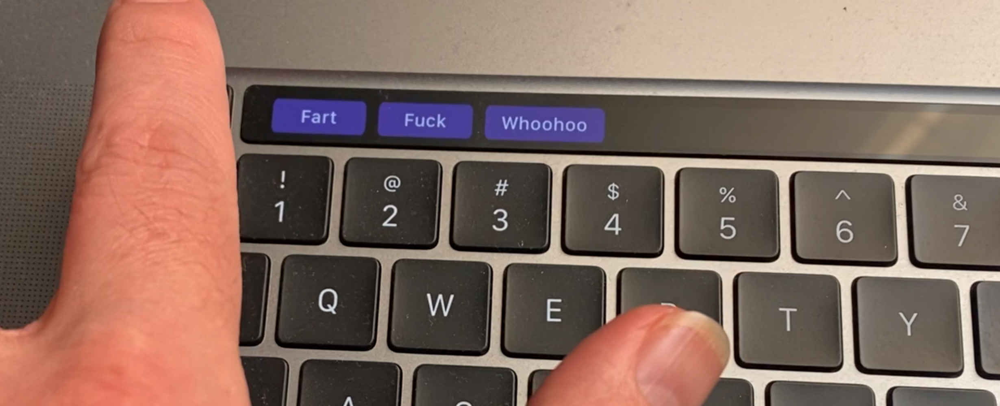

# electron-touch-bar farting and saying f**k

[touch bar demo in action](https://youtu.be/X6nTunDjzIc)

Code is directly taken from these two docs from the Electron team, **all credit goes to them!**

* [quick-start.md](https://github.com/electron/electron/blob/master/docs/tutorial/quick-start.md)
* [touch-bar.md](https://github.com/electron/electron/blob/master/docs/api/touch-bar.md)

## Prerequisites

* latest version of [Node.js](https://nodejs.org/) (at least 6.x.x)
* [MacBook Pro](http://www.apple.com/macbook-pro/) laptop with touch bar

## How to Install

    npm install
    
## How to Run

    npm start

## License

---

Copyright (C) 2021 Mark Phillips ([MIT](LICENSE))
